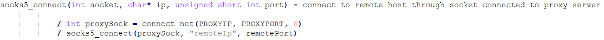
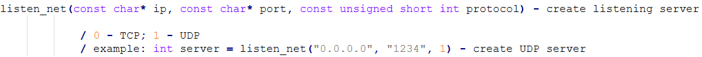
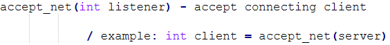
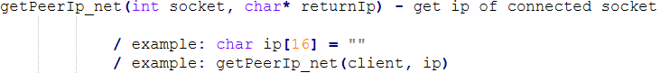
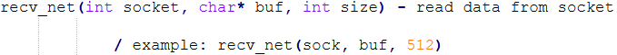
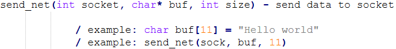
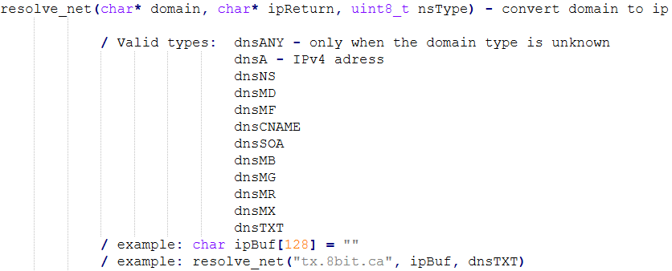

C multiplatform network(TCP/UDP) lib for server and client


**```CLIENT```**
============================================

============================================

============================================
**```SERVER```**
============================================

============================================

============================================

============================================
**```BOTH```**
============================================

============================================

============================================

============================================

============================================
